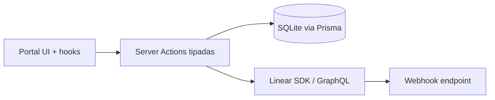

# Architecture Overview

## Stack

- Next.js 16 (App Router + Server Actions)
- React 19 + Tailwind CSS v4
- Prisma 7 + SQLite (`dev.db`)
- Linear GraphQL SDK

## Capas

1. **UI (Client Components)**
   - `app/portal/*`
   - `app/portal/settings/*`
   - `app/admin/*`
2. **Server Actions**
   - `app/actions/*.ts`
   - validacion/autorizacion y orquestacion de datos
3. **Integraciones y DB**
   - `lib/linear.ts`, `lib/prisma.ts`, `lib/auth.ts`
   - Prisma models en `prisma/schema.prisma`

## Flujo principal (portal)

## Entidades clave

- `Account`: organizacion cliente
- `Board`: vista por cuenta y tipo (`SUPPORT` o `PROJECT`)
  - Regla: unico por `accountId + type`
- `User`: operador interno con rol y link opcional a customer en Linear

## Modos de board

- `SUPPORT`
  - Permite crear tickets desde portal
- `PROJECT`
  - Solo lectura para creacion de tickets
  - Sirve para visibilidad de estado/progreso

## Seguridad

- `requireAuth` / `requireAdmin` en server actions
- `CONBIZ_AUTH_BYPASS=true` solo permitido en dev (`NODE_ENV !== production`)
- archivos de Linear se sirven via proxy autenticado (`/api/linear/file`)

## Actividad reciente

- Delta incremental por `since`
- persistencia local de vistos por board (`localStorage`)
- polling adaptativo y consolidacion por `issue update` y comentarios con `#sync`
