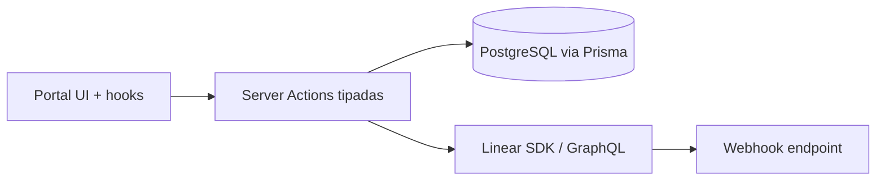

# Architecture Overview

## Stack

- Next.js 16 (App Router + Server Actions)
- React 19 + Tailwind CSS v4
- Prisma 7 + PostgreSQL
- Linear GraphQL SDK v71

## Capas

1. **UI (Client Components)**
   - `app/portal/*`
   - `app/portal/settings/*`
   - `app/portal/releases/*`
   - `app/admin/*`
2. **Server Actions**
   - `app/actions/*.ts`
   - validacion/autorizacion y orquestacion de datos
   - contratos tipados via `ActionResult<T>` (`lib/contracts/portal.ts`)
3. **Integraciones y DB**
   - `lib/linear.ts`, `lib/prisma.ts`, `lib/auth.ts`, `lib/password.ts`
   - Prisma models en `prisma/schema.prisma`

## Flujo principal (portal)

```mermaid
flowchart LR
  UI[Portal UI + hooks] --> SA[Server Actions tipadas]
  SA --> PR[(PostgreSQL via Prisma)]
  SA --> LIN[Linear SDK / GraphQL]
  LIN --> WEBHOOK[Webhook endpoint]
```

## Entidades clave

- `Account`: organizacion cliente
- `Board`: vista por cuenta y tipo (`SUPPORT` o `PROJECT`)
  - Regla: unico por `accountId + type`
- `User`: operador interno con rol y link opcional a customer en Linear
- `Session`: sesion autenticada con token hasheado (SHA-256), TTL 14 dias
- `UserBoardAccess`: junction table que otorga acceso de VIEWER a boards especificos
- `Release`: entrada de release notes (DRAFT → PUBLISHED)
- `ReleaseItem`: snapshot de ticket de Linear adjunto a una Release
- `ReleaseTag` / `ReleaseTagAssignment`: etiquetas de categorizacion para releases

## Modos de board

- `SUPPORT`
  - Permite crear tickets desde portal
- `PROJECT`
  - Solo lectura para creacion de tickets
  - Sirve para visibilidad de estado/progreso

## Autenticacion y autorizacion

- Session-based auth: password hasheado con scrypt, cookie `conbiz_session` (httpOnly, Secure en prod)
- Roles:
  - `ADMIN`: acceso completo a todos los boards, usuarios, releases y mutaciones
  - `VIEWER`: acceso solo a boards donde existe `UserBoardAccess`; lectura de tickets y releases
- Guards en server actions: `requireAuth()` y `requireAdmin()`
- `CONBIZ_AUTH_BYPASS=true` solo permitido en dev (`NODE_ENV !== production`)
- Legacy fallback: headers `x-conbiz-user-id`, `x-conbiz-user-role`, `x-conbiz-user-email`

## Release Notes

- Admin crea release en estado DRAFT
- Adjunta tickets de Linear como `ReleaseItem` (snapshot de datos en momento de adjuntar)
- Publica → estado PUBLISHED, `publishedAt` se establece
- Viewers ven timeline paginado de releases PUBLISHED filtrado por sus cuentas
- Tags (`ReleaseTag`) para categorizacion

## Seguridad

- `requireAuth` / `requireAdmin` en server actions
- `CONBIZ_AUTH_BYPASS=true` solo permitido en dev (`NODE_ENV !== production`)
- Archivos de Linear se sirven via proxy autenticado (`/api/linear/file`), solo `uploads.linear.app`
- Webhook valida firma HMAC-SHA256 + timestamp (ventana 60s, prevencion de replay)
- Markdown sanitizado con `rehype-sanitize`

## Actividad reciente

- Delta incremental por `since`
- Persistencia local de vistos por board (`localStorage`)
- Polling adaptativo y consolidacion por `issue update` y comentarios con `#sync`
