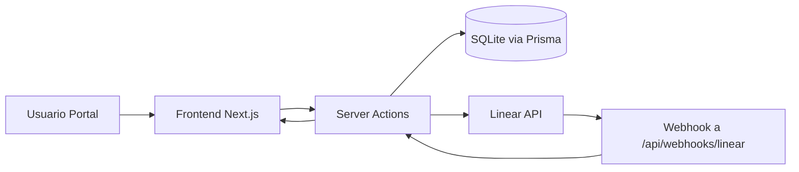
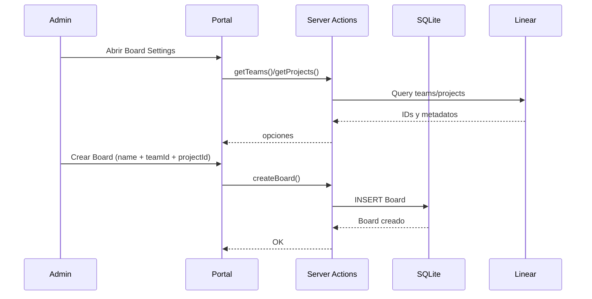
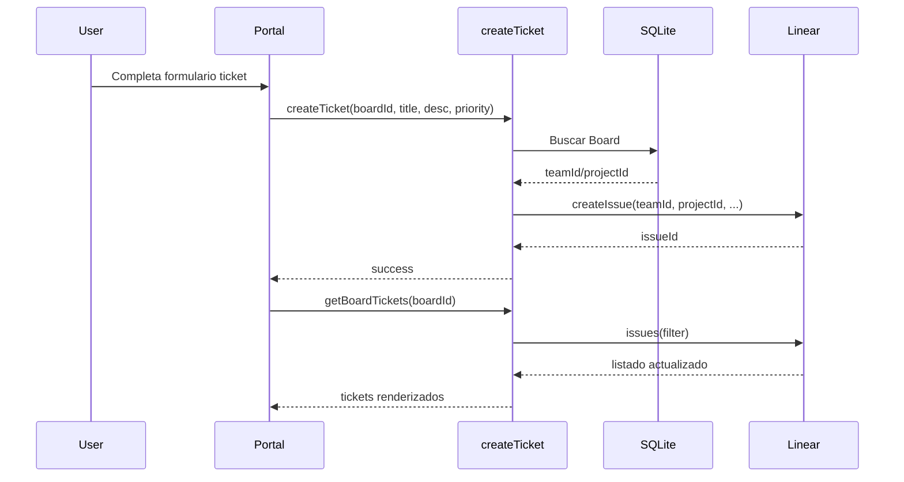
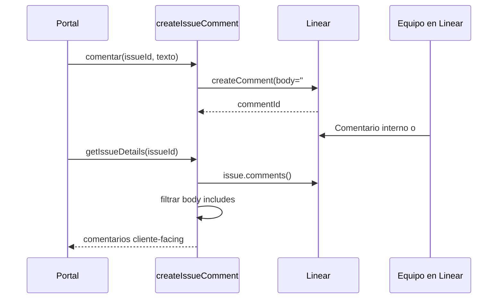

# Arquitectura de Sistemas - Conbiz Ticket Support

## 1) Resumen ejecutivo
Conbiz Ticket Support es un modulo web (Next.js) que funciona como portal de atencion para clientes y como consola operativa para el equipo interno. La aplicacion **no reemplaza Linear**: se integra con su API para crear/leer tickets (issues), comentarios y actividad.

En alto nivel:
- Frontend (portal + admin) en Next.js App Router.
- Backend en Server Actions y Route Handlers dentro del mismo proyecto Next.js.
- Persistencia local en SQLite (Prisma) para entidades internas (`Board`, `User`).
- Fuente de verdad de tickets y estados: **Linear**.

---

## 2) Stack y rol de cada tecnologia

### Frameworks y runtime
- `Next.js 16` (`app/`): UI, routing, Server Actions, APIs internas.
- `React 19`: componentes cliente/servidor.
- `TypeScript`: tipado estatico.

### UI y experiencia
- `Tailwind CSS v4`: estilos utilitarios y design tokens (`app/globals.css`).
- `lucide-react`: iconografia (prioridades, acciones, estado UI).

### Datos y persistencia
- `Prisma 7` + `@prisma/client`: ORM.
- `SQLite` (`dev.db`) + `@prisma/adapter-better-sqlite3`: base local.
- Modelos actuales (`prisma/schema.prisma`):
  - `Board`: mapea portal -> `teamId`/`projectId` de Linear.
  - `User`: usuarios internos/locales con rol y referencia opcional a Customer de Linear.

### Integracion externa
- `@linear/sdk`: cliente oficial para GraphQL de Linear.
- Webhooks de Linear (`app/api/webhooks/linear/route.ts`): validacion HMAC + timestamp.
- Proxy de archivos de Linear (`app/api/linear/file/route.ts`): acceso autenticado a `uploads.linear.app`.

### Seguridad / acceso
- Guardas de auth (`lib/auth.ts`):
  - Header/cookie-based (`x-conbiz-user-id`, `x-conbiz-user-role`, etc.).
  - Bypass de desarrollo por `CONBIZ_AUTH_BYPASS=true`.
- Middleware (`middleware.ts`): restringe `/admin/*` a `ADMIN`.

---

## 3) Servicios internos y responsabilidades

### A. Capa de integracion (lib)
- `lib/linear.ts`
  - Inicializa `LinearClient` con `LINEAR_API_KEY`.
  - Pide URLs temporales de archivos (`public-file-urls-expire-in`).
- `lib/prisma.ts`
  - Inicializa PrismaClient con adapter SQLite.
- `lib/auth.ts`
  - Resuelve identidad y rol.
  - Expone `requireAuth()` y `requireAdmin()`.

### B. Capa de dominio (Server Actions)
- `app/actions/boards.ts`
  - `getBoards()`: lista tableros locales.
  - `createBoard()`: crea tablero (solo admin).
- `app/actions/tickets.ts`
  - `createTicket()`: crea issue en Linear usando el mapeo del board.
- `app/actions/portal.ts`
  - `getBoardTickets()`: trae issues por board (team/project).
  - `getIssueDetails()`: detalle de issue, comentarios y adjuntos.
  - `createIssueComment()`: publica comentario en Linear con etiqueta `#sync`.
  - `getRecentActivity()`: feed de updates/comentarios sincronizados.
- `app/actions/linear.ts`
  - Exploracion/admin de estructura Linear (teams, projects, states, labels, etc.).
- `app/actions/users.ts`
  - CRUD de usuarios internos, sincronizacion opcional con Customer en Linear.

### C. Capa API (Route Handlers)
- `app/api/webhooks/linear/route.ts`
  - Recibe eventos push de Linear.
  - Valida firma y ventana temporal.
  - Actualmente preparado para extender logica de sync local.
- `app/api/linear/file/route.ts`
  - Baja archivos privados de Linear autenticando server-to-server.

### D. Capa de presentacion
- `app/page.tsx` -> `app/portal/page.tsx` -> `app/portal/portal-view.tsx`
  - Portal principal: tabla/kanban, detalle de ticket, comentarios, actividad.
- `app/admin/*`
  - Herramientas internas para diagnostico y gestion.

---

## 4) Flujo de interaccion entre sistemas (end-to-end)

### Lectura clave
- `Board` y metadatos internos viven en SQLite.
- Tickets/estados/comentarios/adjuntos viven en Linear.
- La UI compone ambas fuentes para mostrar una vista unificada.

---

## 5) Flujo: crear nueva organizacion, board y tickets

## 5.1 Organizacion
Importante: hoy la app **no crea organizaciones en Linear**. La organizacion/workspace se administra en Linear.

Flujo recomendado:
1. Crear/configurar organizacion, equipo(s) y proyecto(s) en Linear.
2. Desde el portal (Board Settings), seleccionar `teamId` y opcional `projectId`.
3. Guardar `Board` local que queda enlazado a esa estructura de Linear.

## 5.2 Ticket (Issue) nuevo

---

## 6) Flujo de comentarios y sincronizacion

Regla actual: el portal solo muestra comentarios destinados al cliente. Se filtran por `#sync`.

- Cuando comentas desde portal:
  - `createIssueComment()` envia comentario a Linear con prefijo `#sync`.
- Cuando el equipo comenta en Linear:
  - Si incluye `#sync`, aparece en el portal.
  - Si no incluye `#sync`, queda interno al equipo.

---

## 7) Flujo de actividad reciente

`getRecentActivity(boardId)` compone eventos desde Linear:
- `update` de issue (`issue.updatedAt`).
- `comment` con `#sync`.

UI:
- Boton de campana muestra badge rojo cuando hay items no leidos.
- Click en item abre ticket y marca ese item como leido.
- `Read all` limpia lista local de no leidos.

Nota: el estado de leido hoy es de sesion/UI (cliente), no persistido en DB.

---

## 8) Seguridad y control de acceso

- `requireAuth()` en acciones de portal/boards/tickets.
- `requireAdmin()` en acciones administrativas y exploracion sensible.
- `middleware.ts` protege rutas `/admin/*`.
- Webhooks:
  - valida `linear-signature` con HMAC SHA-256.
  - usa `timingSafeEqual`.
  - valida `webhookTimestamp` en ventana de tiempo.

---

## 9) Configuracion de entorno

Variables principales:
- `LINEAR_API_KEY`: token de API de Linear.
- `LINEAR_WEBHOOK_SECRET`: secreto de firma para webhooks.
- `DATABASE_URL`: ruta sqlite (`file:./dev.db`).
- `CONBIZ_AUTH_BYPASS`: bypass auth en desarrollo.
- `LINEAR_FILE_URL_EXPIRES_IN`: expiracion URLs publicas de archivos.

---

## 10) Limites actuales y roadmap sugerido

Limites actuales:
- No existe entidad `Organization` local; se depende de estructura previa en Linear.
- Estado de notificaciones leidas no es persistente.
- Webhook aun no ejecuta sync avanzada de entidades locales.

Roadmap pragmático:
1. Persistir notificaciones y estado leido por usuario en DB.
2. Implementar pipeline webhook -> eventos internos -> proyeccion local.
3. Agregar auditoria de cambios por ticket (quien, que cambio, cuando).
4. Definir contrato de integracion con plataforma host (headers JWT/claims).

---

## 11) Mapa rapido de archivos clave

- `app/portal/portal-view.tsx`: UX principal (tabla, kanban, detalle, actividad).
- `app/actions/portal.ts`: lectura/escritura de tickets, comentarios, actividad.
- `app/actions/tickets.ts`: creacion de issues en Linear.
- `app/actions/boards.ts`: mapeo board -> team/project.
- `app/api/webhooks/linear/route.ts`: entrada de eventos de Linear.
- `app/api/linear/file/route.ts`: proxy de archivos privados.
- `lib/auth.ts`: auth y roles.
- `lib/linear.ts`: cliente Linear.
- `lib/prisma.ts`: cliente Prisma.
- `prisma/schema.prisma`: modelo de datos local.

